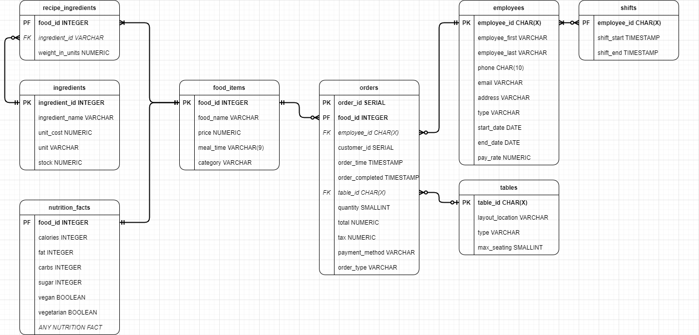

<h1>Westway-Diner-Data-Model</h1>

<b>You are working at a restaurant and the owner wants to track the profit and profit margin of the menu at the item level. Build the data infrastructure required to answer the owner’s question.</b>
<ul>
  <li> You know how much the business charges for a meal and how much the individual items cost to source from the distributors, but you don’t know the cost to make the meal. </li>
  <li> Meals don’t necessarily use whole ingredients. For example, a sandwich could use half of a tomato. </li>
</ul>

<h2> DS. Williams Data Model + Query </h2>
<p align='center'>
    
    <p align='center'> Figure 1. Entity Relationship Diagram of the Database </p>
</p>


```sql
WITH production_cost AS (
    SELECT
      food_id,
      SUM(weight_in_units * unit_cost) AS cost_to_make
    FROM recipes
    LEFT JOIN ingredients
        USING (ingredient_id)
    GROUP BY food_id
)
SELECT
  food_id,
  food_name,
  SUM(quantity * (price - cost_to_make)) AS profit,
  SUM(quantity * (price - cost_to_make)) * 100 / SUM(total) AS profit_margin
FROM orders
LEFT JOIN production_cost
    USING (food_id)
LEFT JOIN food_items
    USING (food_id)
GROUP BY 
  food_id, 
  food_name
WHERE 
  order_time BETWEEN '' AND ''
```


<h2> DS. Williams Commentary </h2>
The two issues that I saw up front was how to map customizations and ingredients to food items. For example, there may be customizations that are “set in stone” such as Belgium Waffles + Bacon, but we need to think about how to charge customers that go “off script”, for example Belgium Waffles + Every Fruit. My solution to both problems is to store every customization as a food item and change the way orders are documented. By storing all the customizations separate we can track the profits of the customizations as well. <br />

The downfall that I see to this is that it would be difficult to track the profit of “pairs”  of items such as Belgium + Bacon. Tracking pairs could be important; picture this:
<ul>
  <li> The profit of the Belgium waffle is high. </li>
  <li> The profit of bacon is negative. </li>
</ul>

The company is thinking of removing bacon from the menu, however what if the people who buy Belgium Waffles mainly add the bacon customization. Furthermore, the customer sentiment is that the “Belgium Waffle isn’t worth it without the bacon”. Removing bacon could potentially do more harm than good. I see two solutions to the "Bacon Profit Paradox":
<ul>
  <li> Take the profit hit because other items are making up for it. </li>
  <li> Increase the price of bacon to be <b>AT LEAST</b> 0 profit. </li>
</ul>

<i>I think these cases can generally be ignored since tracking combinations is an unsustainable venture. The restaurant will have a set of customizables and base items. The number of customization “pairs” could be ESTIMATED by: </i>

<p align='center'>
     
</p>

<i>If you had 10 base items and 5 customizables, that would be 310 pairs. <b>This formula can’t be taken as fact because there are some pairs that don’t make sense in regard to the likelihood of it being ordered (Coffee + Bacon)</b></i>. <br />
  
<hr>

<h3> User Interface Ideas </h3>
<b>Things The Waiter & Customer Inteface Should Do Against the Database</b>
<ul>
  <li> What meals have specific item/s </li>
  <li> Show and filter nutrition facts </li>
  <li> Show and filter meal_times (Breakfast, Lunch, Dinner) and by category </li>
  <li> Track and update ingredient stock and dsiplay when they don't have a certain item </li>
  <li> Update orders </li>
</ul>

<b>Things that the Waiter Interface Should Do Against the Database</b>
<ul>
  <li> Visually track the layour of the restaurant, the customer_ids at the tables, and the orders </li>
</ul>

<b>Things the Cook Interface Should Do Against the Database</b>
<ul>
  <li> Display the Ingredients of a all food items </li>
  <li> Display the ingredients of food items in a particular order </li>
  <li> Update the "order_completed" column of the orders table </li>
</ul>


